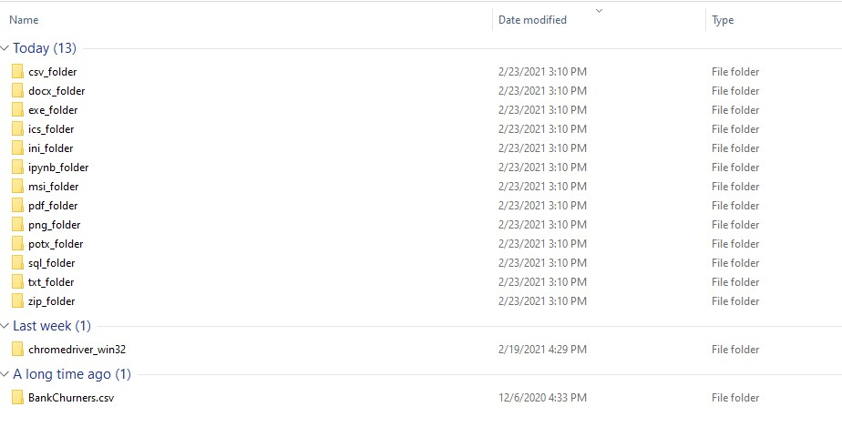

# Organize Downloads Folder

##### This script will help organizing your downloads folder using Python. The script will create folders and name them based on files type then move all files to their the assigned folder.

To automate this script and run it daily/weekly/monthly, you can schedule the script using Windows Scheduler. For more info: https://datatofish.com/python-script-windows-scheduler/

